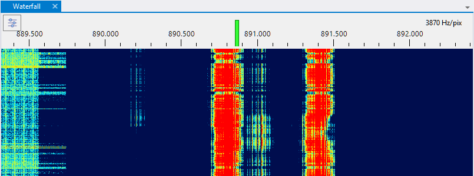
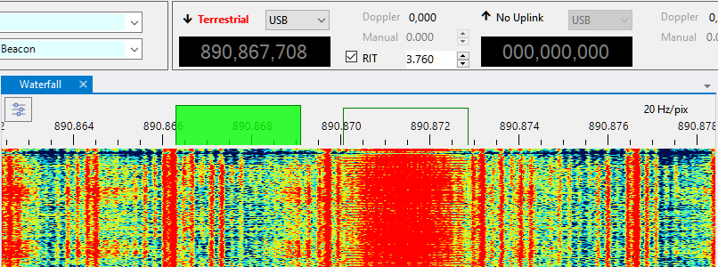

# Calibrating PPM Correction

## Motivation

The clock frequency of an SDR, as it comes from the factory, is rarely accurate. Typical errors are in the range of
a few PPM (parts per million),
which translates to a tuning error of 1-2 Khz on the 70 cm band. For accurate tracking of the satellite signals this error
must be calibrated out. The calibration process is simple, we just find a signal of known frequency, check on what frequecy it
appears on the waterfall, and compute the PPM correction factor from the difference between the two.

There are plenty of signals on the air that may be used for calibration, if one knows what to look for. One of such
signals is the
[FCCH channel](https://en.wikipedia.org/wiki/FCCH)
of a
[GSM](https://en.wikipedia.org/wiki/GSM_frequency_bands)
downlink. This channel is located 67,708 Hz above the center frequency of a GSM channel, and the accuracy of its
frequency is claimed to be better than 0.05 PPM.

## 3-rd Party Software

For the RTL-SDR dongles you can use the
[Kalibrate](https://github.com/steve-m/kalibrate-rtl)
utility that performs such calibration automatically. For other radios follow the steps below.

## Steps

1. Find a strong GSM signal, or any other signal of known frequency. In my area one of such signals is present on 890.8 MHz.
2. Click on the Downlink frequency display in the
[Frequency Control](frequency_control.md)
panel on the toolbar to open the frequency entry dialog:

    

3. Enter the frequency of the channel plus the FCCH offset:

    ```text
    890,800,000 + 67,708 = 890,867,708 Hz
    ```

4. Click on the Tune button in the dialog and verify that the SDR is tuned to the desired frequency:

    

5. Zoom in by spinning the mouse wheel over the waterfall display:
6. Find the FCCH signal. On the screenshot below it is about 4 kHz above the expected frequency:

    

7. Now let us measure the offset between the receiver frequency (the center of the green rectangle that represents
    the receiver passband) and the FCCH frequency. Tick the **RIT** checkbox on the **Frequency Control panel**
    and adjust the RIT offset until the RIT passband (the clear rectangle) aligns with the signal.
    You can tune RIT in many different ways, as described in the
    [Frequency Control](frequency_control.md) and [Frequency Scale](frequency_scale.md) sections. For now, just use the
    up/down buttons in the RIT offset box, or spin the mouse wheel over that box.

8. Compute the PPM correction. The frequency error measured in the previuos step is 3,760 Hz, so the PPM is:

    ```text
    3,760 / 890,867,708 * 1e6 = 4.22 PPM
    ```

9. Now enter this value in the [SDR Devices dialog](setting_up_sdr.md), and you are done.
