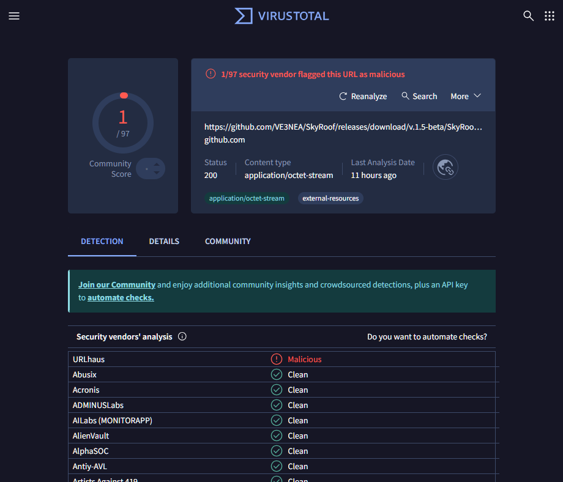

# Frequently Asked Questions

**Q:** I downloaded SkyRoof, and my virus scanner shows an infection. Is it real?

**A:** Most likely, it is a false detection. However, it is always a good idea to test the download links **before** downloading **any** software. There are several online virus scanning services that you can use to check the link.
[VirusTotal](https://www.virustotal.com/gui/home/url) and [Hybrid Analysis](https://www.hybrid-analysis.com/})
are just two examples.

Copy the download link and paste it in the virus scanner page. The scanner
will download the file, test it with multiple antivirus programs, and show you the results.

In the screenshot below the download link of SkyRoof 1.5 beta was tested with VirtusTotal, and all virus scanners, except one, agreed that the file was clean. When you see something like this, you know that it was a false alarm.

If the file is clean, you can add it to the exception list of your virus scanner and safely install it. For Windows Defender follow
[these instructions](https://support.microsoft.com/en-us/windows/add-an-exclusion-to-windows-security-811816c0-4dfd-af4a-47e4-c301afe13b26#ID0EBF=Windows_11), for other anti-virus products
follow the instructions in their documentation.

To prevent such problems in the future, please submit the file to Microsoft for analysis using this link:

[https://www.microsoft.com/en-us/wdsi/filesubmission](https://www.microsoft.com/en-us/wdsi/filesubmission)

  

---

**Q:** The right part of the SkyRoof toolbar does not fit in the screen, even though the screen resolution is 1980x1280.

**A:** This happens because your **text size** setting in Windows is too high. For example, if it is set to 200%, the effective
screen width is only `1900 / 2 = 950 pixels`. To fix this, right-click on the Desktop, click on **Display Settings** and set the text size
to a lower value.

---

**Q:** How can I run two instances of SkyRoof?

**A:** By default, only one instance of SkyRoof can run at any time, but there is a work around. Make a copy of the SkyRoof.exe file in the same folder, but with a different name, e.g., SkyRoof_2.exe. Each exe will have its own settings, its own data folder, and will run independently of the other instance.

---

**Q:** I found an error in the satellite database: one of the satellite transmitters is marked as active, while it has been inactive for years. How can I correct the error?

**A:** SkyRoof uses
[satellite data](satellite_data.md)
from the
[SatNOGS database](https://db.satnogs.org/).
This database is crowd-sourced, so anyone can suggest changes.
If you find an error in a satellite record (shown in the
[Satellite Details](satellite_details_panel.md)
and
[Satellite Transmitters](satellite_transmitters_panel.md)
 panels), click on the "SatNOGS" link in the Satellite Details panel  to open the SatNOGS web site, then click on Transmitters, and select Edit from the drop-down menu. You may need to create an account with them (free) in order to submit changes.

---

**Q:** How can I add a satellite that is currently not listed in SkyRoof?

**A:** The only way to add a satellite to SkyRoof is to add it to the SatNOGS database. Here is how you can do this:

- navigate to the [SatNOGS DB web site](https://db.satnogs.org/);
- click on **Sign Up / Log In** in the top right corner of the page;
- create a free account, or log in to an existing one;
- click on **All Satellites**;
- in the **Actions** drop-down list select **Suggest New Satellite*.

---

**Q:** My video card does not have an OpenGL 3.3 driver. Is there a way to use a software-only implementation of OpenGL?

**A:** Some users have had success with the OpenGL 3.3 functionality implemented in the software, though this solution is very CPU-intensive. You can try
[this](https://github.com/lightningterror/Mesa3D-Windows) or
[this](https://github.com/pal1000/mesa-dist-win) solution. Download the 64-bit version of the library and extract all DLL's from the archive to the SkyRoof folder.

---

**Q:** How do I prevent CTCSS from turning off when using SkyRoof with FM satellites and an Icom radio?

**A:** If you're experiencing an issue where the CTCSS tone turns off when transmitting or changing frequencies with SkyRoof and an Icom radio, the solution is to disable the "Auto Repeater" setting in the radio. This setting causes the radio to automatically disable repeater-related features like CTCSS when the frequency is changed, assuming you're no longer on a repeater. Disabling "Auto Repeater" prevents this behavior and keeps CTCSS enabled during frequency changes. This workaround was highlighted in a helpful [YouTube video](https://www.youtube.com/watch?v=6xO3LNsTidQ).

---

**Q:** What are all those offset settings for?

**A:**

- **Downlink Manual Correction:** the frequencies of most satellite transmitters slightly differ from their published values. The purpose of this setting is to compensate for the difference, you set it once for each satellite and never change it again;

- **RIT:** just as in any HF radio, it is used to quickly switch the receiver between two frequencies close to each other. A typical use case is when someone answers your CQ slightly off the frequency and you want to tune to it without changing your main operating frequency;

- **Uplink Manual Correction:** this setting allows you to precisely align your own signal received back from the satellite with your receiver frequency. It needs to be set only once per satellite, and the offset is usually very small;

- **Transponder Offset:** the position of your operating frequency within the transponder passband. This offset is included in the Corrected Downlink Frequency shown on the toolbar, the actual value of the offset is shown only on the mouse tooltip of the frequency display. There are many ways to tune within the transponder passband, such as click on the desired frequency, drag the green passband rectangle, spin the mouse wheel over the rectangle, etc. These methods work only when the transponder is selected in the Transmitter drop-down box.

- **Doppler correction:** this correction is computed and applied automatically, it keeps your RX and TX signals in sync when you tune through the transponder segment.
