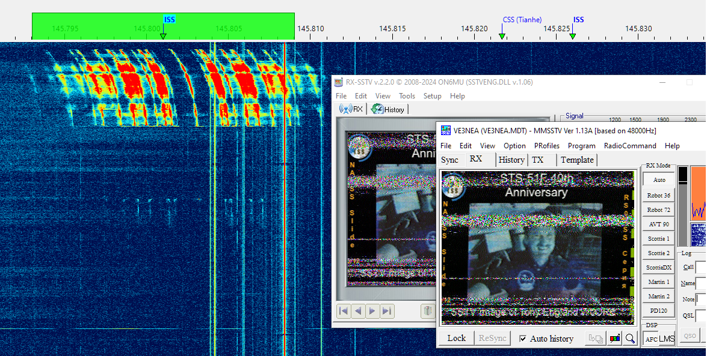

# How to Receive SSTV from ISS

There are two popular programs that demodulate SSTV: **MMSSTV** and **RX-SSTV**,
either one may be used with SkyRoof to receive SSTV transmissions form ISS.

## Installing VAC

A virtual audio cable, VAC, is required to pass the satellite signals demodulated in SkyRoof to the SSTV decoding program. Download and install [VB-Audio](https://vb-audio.com/Cable/index.htm) if you do not have it yet, and reboot your system. Be sure to get the latest version (2024) of VB-Audio, the old version may not work correctly.

## Setting Up MMSSTV

- download [MMSSTV](https://hamsoft.ca/pages/mmsstv.php), install it and run the program;
- click on **Option / Setup MMSSTV** in the menu to open the settings dialog, and:
  - click on the **Misc** tab;
  - select your VAC in the **Sound Card / In** drop-down list;
  - enter "48000" in the **Clock / Hz** box.
- in the main window:
  - click on the **RX** tab;
  - in the **RX Mode** panel right-click on the second and third button, and select "PD120" and "PD180" respectively;
  - click on **RX Mode / Auto**.

## Setting Up RX-SSTV

- download [RX-SSTV](https://www.qsl.net/on6mu/rxsstv.htm), install it and run the program;
- in the **Sound Card Selection** window that pops up on start-up select your VAC as **Sound Input**;
- click on **Setup / SSTV Engine** in the menu, click on the **Misc**  tab, and set **Clock / Hz** to "12000";
- click on **Setup / RX-SSTV** in the menu, under **User-defined buttons** set the first two buttons to "PD120" and" PD-180";
- in the main window:
  - click on the **RX** tab;
  - click on the **PD120** or **PD180** button, depending on the mode used at ISS (see below).

## Setting Up SkyRoof

In SkyRoof:

- select the **ARISS** satellite. If it is not in the current group, add it using the
[Satellites and Groups](satellites_and_groups_window.md) dialog;
- Select ISS transmitter that is used to send SSTV (see below);
- Select **FM** downlink mode in the drop-down list on the toolbar;
- in the **Output Stream** section of the [Settings](setting_up_output_stream.md) window:
  - select **Audio to VAC**;
  - set Gain, dB to 0;
  - select the VAC in the list of audio devices;
  - click on the Output Stream label on the status bar to enable the output stream.

## Receiving SSTV

Find out when the next SSTV activity on ISS will take place, usually it happens every few months and lasts for up to a week. One good source of information about such activities is the
[ARISS web site](https://www.ariss.org/upcoming-sstv-events.html). You will need to know:
  
- when SSTV signals will be transmitted;
- which transmitter on ISS will be used, usually it is one of these:
  - **Mode U - SSTV** on 437.800 MHz;
  - **Mode V Imaging** on 145.800 MHz;
- which SSTV mode will be used, usually it is either **PD120** or **PD180**. In these modes the image transmission takes 120 s and 180 s respectively.

In SkyRoof, select ARISS in the list of satellites, and the transmitter that is used in the current SSTV activity. When ISS rises above the horizon and its signals start to appear on the waterfall, the RX-SSTV or MMSSTV program automatically starts decoding the image. If for some reason it doesn't, click on the SSTV mode button (PD120 or PD180) to start it manually.

Here is an example of an image received from ISS in July 2025. Both SSTV decoders seem to have the same image quality, which is mainly determined by the signal strength variations:

